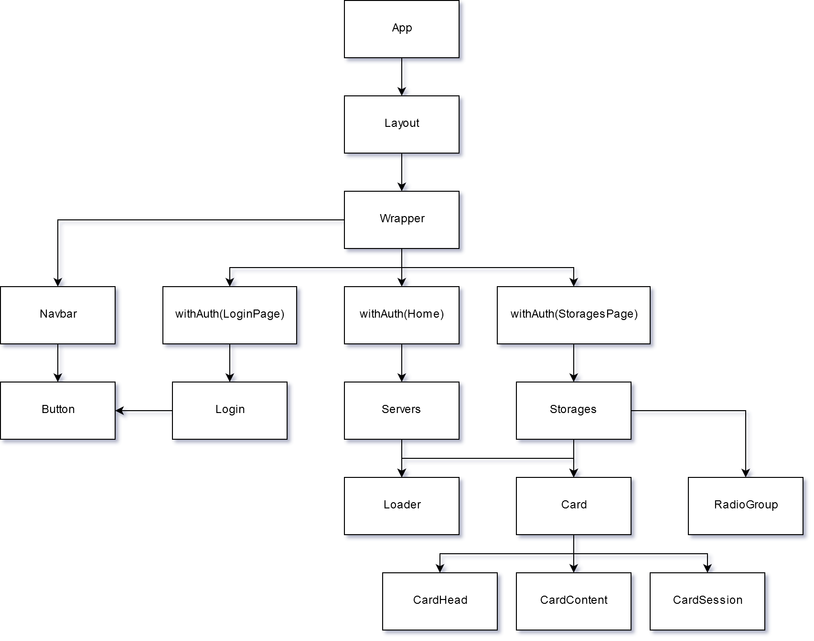

# UpCloud Frontend App

The application is designed responsive for all devices. Users can login with username and password from Upcloud. User cannot access to the application without login.

The home page shows a server list with each server's title, state (green = started, red = stopped, yellow = any other state), and hostname. Users can sort the list by title or hostname. Users can go back to the main page via the `Servers` link or the logo in the navbar. 

Users can open the `Storages` page via the `Storages` link in the navbar. This page shows a simple list of storages with their title and size. Users can sort the list by title or size, filter the list to show public, private or all storages.

## Getting Started

Clone the repository in your Terminal and install the required packages with `yarn install` or `npm i`. Then run the app by one of the following ways:

1. Start the dev server with `yarn dev` or `npm run dev`.
2. Using docker: `docker build -t uc-app .` then `docker run -p 3000:80 uc-app`.
3. Using docker-compose: `docker-compose up --build`.

Or using a ready docker image with `docker run -p 3000:80 kenjifam/uc-app`.

Open http://localhost:3000 and you should see the login page.

## Technology Stack

- Front-end: TypeScript, Next.js, React.js, styled-jsx, Sass/SCSS
- Testing: Jest, Enzyme
- CI: Travis CI
- Web server: Nginx
- Deploy: Docker, Upcloud Linux Server

## Component Structure

## CI strategy

1. Build test image.
2. Run tests.
3. Build production image.
4. Push image on docker hub.
5. Copy deploy script to Upcloud server.
6. Login Upcloud server by ssh and run deploy script.
7. The Upcloud server stops the container, pulls the new image from docker hub then runs the container again in background.
